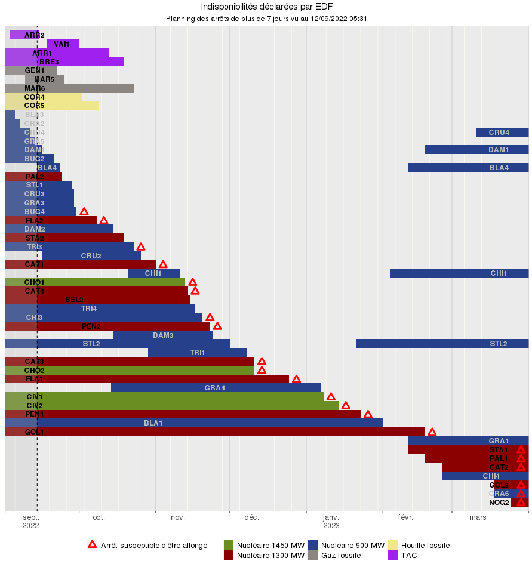

# Instaplan
Application `R` `Shiny` pour visualiser l'empilement des indisponibilités de production EDF. Testée localement et déployée sur `shinyapps.io`.

## Description
Suite à la publication à l'externe par RTE de son [étude prévisionnelle pour l’hiver 2022-2023](https://www.rte-france.com/actualites/previsions-systeme-electrique-hiver-2022-2023), un suivi régulier des re-déclarations du planning nucléaire est intéressant. Le graphique d'empilement des indisponibilités du producteur EDF est accessible sur un site web interne hébergé par l'infrastructure `shinyapps.io` : https://applis.shinyapps.io/instaplan/

Pour avoir un graphique similaire à celui publié par RTE en page 19 de son [rapport complet](https://assets.rte-france.com/prod/public/2022-09/Analyse%20passage%20hiver%202022-2023.pdf), voici le lien avec les paramètres adéquats : https://applis.shinyapps.io/instaplan/?debut=03092022&fin=30032023&duree=7&partiel=100&tri=filiere&filieres=NUC&nom.

Au delà de ce cas d'usage, le site permet l'affichage des indisponibilités EDF de façon graphique avec des options de tri, filtres et dates modifiables.

## Visuel

## Installation
Aucune installation n'est requise, le site est accessible depuis un navigateur.

## Utilisation
À l'ouverture du site, le graphique s'affiche automatiquement avec les paramètres par défaut : l'entête du graphique d'empilement des indisponibilités indique la date du fichier généré par EDF le plus récent (dans le visuel ci-dessus par exemple le `12/09/2022 à 05:31`) ainsi que la durée minimale des indisponibilités affichées (ci-dessus `7 jours`).

### Interface
En cliquant sur chacune des sections en haut ou en bas du graphique (cliquer sur le symbole `+`), il est possible de :

- Définir une période d'observation : l'utilisateur choisit la date de début et fin du graphique.
    - _Astuce 1_ : en cliquant sur le mois en haut de la fenêtre de sélection de date, l'affichage bascule en choix de mois, puis en cliquant sur l'année, l'affichage bascule en choix d'année. Ceci permet de choisir plus vite un mois ou une année lointaine.
    - _Astuce 2_ : en cliquant sur les boutons `+` et `-`, la période d'observation est décalée aux périodes adjacentes.
- Trier : plusieurs options de tri des indisponibilités sont proposées.
- Télécharger le graphique : l'utilisateur clique sur le bouton `Télécharger`.
- Afficher les variations : l'utilisateur choisit ou non d'afficher les variations observées (favorables/défavorables) par rapport à une date de référence de son choix.
- Consulter l'historique : l'utilisateur choisit la date de publication dans le passé à laquelle il souhaite consulter les indisponibilités. Il peut également démarrer une animation qui parcoure automatiquement l'historique et met à jour le graphique.
    - _NB_ : quand la date de référence est modifiée, la date minimale de l'historique s'ajuste automatiquement.
- Charger un fichier des indisponibilités passées : en cliquant sur [le lien](https://www.edf.fr/doaat/export/light/csv) le téléchargement est automatique, il suffit ensuite de charger un tel fichier sur le site via le bouton `Charger`.
- Choisir les filières et les groupes : l'utilisateur sélectionne les filières (ou toutes ou aucune) ainsi que les groupes (ou tous ou aucun).
- Choisir d'afficher le nom complet des groupes : l'utilisateur coche ou non l'affichage du nom complet.
- Choisir la durée minimale d'indisponibilité : l'utilisateur choisit la durée en dessous de laquelle les indisponibilités (courtes) sont masquées, ceci permet un meilleur tri et donc un meilleur affichage.
    - _NB_ : quand la période d'observation est modifiée, la durée minimale d'indisponibilité s'ajuste automatiquement à 2,5% de la période d'observation.
- Choisir d'afficher les indisponibilité partielles : l'utilisateur choisir le pourcentage d'indisponibilité (rapporté à la puissance maximale du groupe) minimal en dessous duquel les indisponibilités sont masquées.
- Choisir d'afficher les indisponibilité faibles : l'utilisateur choisir le volume d'indisponibilité minimal en dessous duquel les indisponibilités sont masquées.

Plusieurs vues existent :

- Détail par groupe : affichage des indisponibilités par groupe sur la période sélectionnée sous forme de diagramme de Gantt.
- Empilement en GW : affichage du volume des indisponibilités par filière sur la période sélectionnée sous forme de graphique en aire, avec le total d'indisponibilité en TWh affiché dans la légende.
- Carte : affichage des indisponiblités par site sur la période sélectionné sous forme de carte géographique.

En fonction de la vue choisie, les options inutilisées sont grisées dans l'interface.

### Paramètres par défaut
Les paramètres _par défaut_ à l'ouverture du site :

- La période d'observation est glissante : période de `13 mois` qui démarre `2 mois` avant la date du jour.
- Le tri : par filière puis palier puis date.
- Les variations : la date de référence est le `15/09/2023`, les variations ne sont pas affichées.
- L'historique : la date affichée est celle du jour, l'historique n'est pas affiché, il s'étend de la date de référence à la date du jour.
- Le fichier d'indisponibilité : le fichier le plus récent est chargé.
- Les filières : toutes sauf les filières hydrauliques.
- Les groupes : tous sauf ceux arrêtés définitivement et toujours déclarés dans les indisponibilités (`FESSENHEIM`, `HAVRE 4`) et ceux en Belgique (`RINGVAART STEG`, `SERAING`).
- Les noms des groupes : code constitué des trois premières lettres du nom complet auquel est accolé le dernier caractère du nom, si besoin.
    - _NB_ : À l'exception de `ST ` qui est remplacé par `SS`, `MONTE` par `MT` et `GRAND ` par `G` afin d'assurer une unicité des codes.
- La durée minimale d'indisponibilité : `10 jours`.
- Le pourcentage d'indisponibilité : `33%`.
- Le volume minimal d'indisponibilite : `85 MW` qui correspond à la puissance maximale des plus petites TAC.

### Les paramètres simples via l'URL
L'utilisateur peut utiliser l'adresse (URL) pour précharger les paramètres. Voici un exemple complet : https://applis.shinyapps.io/instaplan/?debut=03082023&fin=30032024&duree=7&partiel=100&faible=50&tri=filiere&filieres=tout&groupes=SSL1,SSL2,VAI3,GMA11&nom&delta&reference=01052023

Les paramètres simples utilisables sont :

- La période d'observation : on peut définir les variables `debut` et `fin` avec le formalisme `JJMMAAAA` où :
    - `JJ` correspond au jour
    - `MM` au mois
    - `AAAA` à l'année
- Le tri : on peut définir la variable `tri` avec plusieurs valeurs possibles, en cohérence avec l’IHM :
    - Filière, palier puis date = `palier`
    - Filière puis date = `filiere`
    - Date = `date`
    - Filière, palier puis nom = `paliernom`
    - Filière puis nom = `filierenom`
    - Nom = `nom`
- Les variations : pour afficher les variations, il suffit de faire figuer la variable `delta` parmi les paramètres
    - _NB_ : ne pas utiliser cette variable revient à ne pas afficher les variations
- La date de référence prise pour afficher les les variations : on peut définir la variable `reference` avec le formalisme `JJMMAAAA` décrit ci-dessus
- Les filières : on peut définir la variable `filieres` avec le choix d'une ou plusieurs des valeurs suivantes séparées par `,` dans l'URL :
    - Nucléaire = `NUC`
    - Gaz fossile = `GAZ`
    - Houille fossile = `HOU`
    - Fuel / TAC = `FUE`
    - Station de transfert d'énergie par pompage hydraulique = `STA`
    - Réservoir hydraulique = `RES`
    - Fil de l'eau et éclusé hydraulique = `FIL`
    - Eolien offshore = `EOL`
    - Energie marine = `ENE`
    - Toutes les filières = `tout`
- Les groupes : on peut définir la variable `groupes` avec le choix d'un ou plusieurs codes séparés par `,` dans l'URL
    - _Rappel_ : le code est constitué des trois premières lettres du nom complet auquel est accolé la dernière lettre du nom (sauf exceptions `ST ` et `GRAND `)
    - Tous les groupes = `tout`
- Les noms des groupes : pour afficher le nom complet, il suffit de faire figuer la variable `nom` parmi les paramètres
    - _NB_ : ne pas utiliser cette variable revient à afficher le code du groupe au lieu du nom complet
- La durée minimale d'indisponibilité : on peut définir la variable `duree` qui s'écrit en jours
    - _Rappel_ : Si la durée n’est pas indiquée, un calcul automatique est effectué et donne une valeur au pro-rata de la période d'observation (2,5%).
- Le pourcentage minimal d'indisponibilite : on peut definir la variable `partiel` qui s'écrit en pourcents.
- Le volume minimal d'indisponibilite : on peut definir la variable `faible` qui s'écrit en MW.

### Les paramètres combinés via l'URL
Les paramètres combinés suivants peuvent être utilisés :

- Vision `hebdo`, `mensuel` ou `annuel` : la période d'observation est ajustée par selon le paramètre choisi autour de la date du jour
- Possibilité de décaler aux périodes adjacentes en utilisant les valeurs `+` et `-`
    - _Exemple 1_ : https://applis.shinyapps.io/instaplan/?hebdo
    - _Exemple 2_ : https://applis.shinyapps.io/instaplan/?mensuel=++

## Support
En cas de soucis, possibilité d'ouvrir des tickets sur https://github.com/faidherbard/instaplan.

## Perspectives
Souhaits de :

- Rapprochement avec l'application de BC et celle de Di

## Contribuer
Les scripts R sont mis à disposition sur https://github.com/faidherbard/instaplan, possibilité ouverte pour contribuer via merge request.

## Auteurs
Conçu par mes soins sur la base de la publication RTE passage de l'hiver 2021/2022, utilisé en script R par la suite puis ajout de la couche Shiny pour l'hiver 2022/2023. Contributeurs exceptionnels : FV, AH !

## License
GPL pour le code source.

ODbL pour les données latitude et longitude en provenance d'OpenStreetMaps :

- Ouvrir l'Assistant dans https://overpass-turbo.eu/
- Indiquer _(power=plant and operator=EDF) in France_ et _(disused:power=plant and operator=EDF) in France_ pour avoir les identifiants
- Obtenir les coordonnées par exemple ainsi https://overpass-turbo.eu/?Q=[out%3Ajson]%3B%0Arelation(5964248)%3B%0Aout%20geom%3B%0A

## Statut du projet
En service sur `shinyapps.io` depuis octobre 2022.
