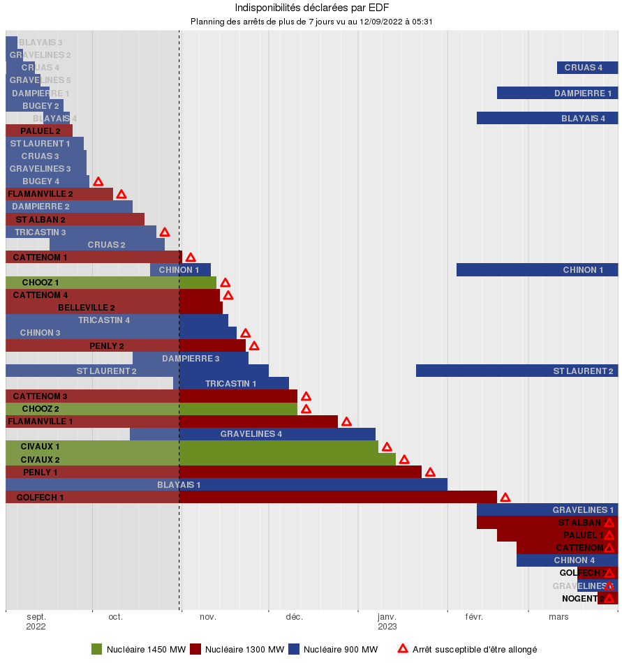

# Instaplan
Application `R` `Shiny` pour visualiser l'empilement des indisponibilités de production EDF. Testée localement et déployée sur `shinyapps.io`.

## Description
Suite à la publication à l'externe par RTE de son [étude prévisionnelle pour l’hiver 2022-2023](https://www.rte-france.com/actualites/previsions-systeme-electrique-hiver-2022-2023), un suivi régulier des re-déclarations du planning nucléaire est intéressant. Le graphique d'empilement des indisponibilités du producteur EDF est accessible sur un site web interne hébergé par l'infrastructure `shinyapps.io` : https://faidherbard.shinyapps.io/instaplan/

Pour avoir un graphique similaire à celui publié par RTE en page 19 de son [rapport complet](https://assets.rte-france.com/prod/public/2022-09/Analyse%20passage%20hiver%202022-2023.pdf), voici le lien avec les paramètres adéquats : https://faidherbard.shinyapps.io/instaplan/?debut=03092022&fin=30032023&duree=7&tri=filiere&nom.

Au delà de ce cas d'usage, le site permet l'affichage des indisponibilités EDF de façon graphique avec des options de tri, filtres et dates modifiables.

_NB_ : Afin de ne pas devoir gérer la fréquence de rafraîchissement des données, le site héberge uniquement le fichier des d'indisponibilité EDF le plus récent et ne va pas le mettre à jour automatiquement. L'utilisateur peut charger tout autre fichier d'indisponibilité récent ou passé pour le visualiser. S'il détecte que ce fichier chargé est plus récent que celui hébergé, alors il le conserve : ceci permet un mécanisme rapide et facile de mise à jour pour tous et par tout un chacun.

## Visuel

## Installation
Aucune installation n'est requise, le site est accessible depuis un navigateur.

## Utilisation
À l'ouverture du site, le graphique s'affiche automatiquement avec les paramètres par défaut : l'entête du graphique d'empilement des indisponibilités indique la date du fichier généré par EDF (dans le visuel ci-dessus par exemple le 12/09/2022 05:31) ainsi que la durée minimale des indisponibilités affichées (ci-dessus 10 jours).

En cliquant sur chacune des sections en haut ou en bas du graphique (cliquer sur le symbole '+'), il est possible de :
- Charger un autre fichier des indisponibilités : en cliquant sur [le lien](https://www.edf.fr/doaat/export/light/csv) le téléchargement est automatique, il suffit ensuite de charger ce fichier sur le site via le bouton "Charger..."
- Télécharger le graphique : clic droit sur le graphique puis Enregistrer l'image sous
- Définir une période d'observation : l'utilisateur choisit la date de début et fin du graphique. _Astuce_ : en cliquant sur le mois en haut de la fenêtre de sélection de date, l'affichage bascule en choix de mois, puis en cliquant sur l'année, l'affichage bascule en choix d'année. Ceci permet de choisir plus vite un mois ou une année lointaine.
- Choisir la durée minimale d'indisponibilité : l'utilisateur choisit la durée en dessous de laquelle les indisponibilités (courtes) sont masquées, ceci permet un meilleur tri et donc un meilleur affichage. _NB_ : quand la période d'observation est modifiée, la durée minimale d'indisponibilité s'ajuste automatiquement à 2,5% de la période d'observation.
- Choisir d'afficher les indisponibilité partielles : l'utilisateur choisir le pourcentage d'indisponibilité (rapporté à la puissance maximale du groupe) minimal en dessous duquel les indisponibilités (mineures) sont masquées.
- Trier : plusieurs options de tri des indisponibilités sont proposées.
- Choisir les filières et les groupes : l'utilisateur sélectionne les filières (ou toutes ou aucune) ainsi que les groupes (ou tous ou aucun).
- Choisir d'afficher le nom complet des groupes : l'utilisateur coche ou non l'affichage du nom complet.

Les paramètres _par défaut_ à l'ouverture du site :
- Le fichier d'indisponibilité : le fichier plus récent hébergé sur le site est chargé.
- La période d'observation est glissante : période de 13 mois qui démarre 2 mois avant la date du jour.
- La durée minimale d'indisponibilité : 10 jours.
- Le pourcentage d'indisponibilité : 33%.
- Le tri : par filière, puis palier puis date.
- Les filières : toutes sauf les filières hydrauliques.
- Les groupes : tous sauf ceux arrêtés définitivement (`FESSENHEIM`, `HAVRE 4`, `CORDEMAIS 3`) et ceux en Belgique (`RINGVAART STEG`, `SERAING`).
- Les noms des groupes : code constitué des trois premières lettres du nom complet auquel est accolé la dernière lettre du nom. _NB_ : À l'exception de `ST ` qui est remplacé par `SS` et `GRAND ` par `G` afin d'assurer une unicité des codes.

L'utilisateur peut utiliser l'adresse (URL) pour précharger les paramètres. Voici un exemple complet : https://faidherbard.shinyapps.io/instaplan/?debut=03092022&fin=30032023&duree=7&partiel=100&tri=filiere&filieres=NUC,FUE&groupes=SSL1,SSL2,VAI1,VAI2&nom
- La période d'observation : on peut définir les variables `debut` et `fin` avec le formalisme `JJMMAAAA` où `JJ` correspond au jour, `MM` au mois et `AAAA` à l'année.
- La durée minimale d'indisponibilité : on peut définir la variable `duree` qui s'écrit en jours. _Rappel_ : Si la durée n’est pas indiquée, un calcul automatique est effectué et donne une valeur au pro-rata de la période d'observation (2,5%).
- Le pourcentage d'indisponibilite : on peut definir la variable `partiel` qui s'écrit en pourcents. 
- Le tri : on peut définir la variable `tri` avec plusieurs valeurs possibles, en cohérence avec l’IHM :
    - Filière, palier puis date = `palier`
    - Filière puis date = `filiere`
    - Date = `date`
    - Filière, palier puis nom = `paliernom`
    - Filière puis nom = `filierenom`
    - Nom = `nom`
- Les filières ; on peut définir la variable `filieres` avec le choix d'une ou plusieurs des valeurs suivantes (séparées par `,` dans l'URL) :
    - Nucléaire = `NUC`
    - Gaz fossile = `GAZ`
    - Houille fossile = `HOU`
    - Fuel / TAC = `FUE`
    - Station de transfert d'énergie par pompage hydraulique = `STA`
    - Réservoir hydraulique = `RES`
    - Fil de l'eau et éclusé hydraulique = `FIL`
- Les groupes ; on peut définir la variable `groupes` avec le choix d'un ou plusieurs codes (séparées par `,` dans l'URL). _Rappel_ : le code est constitué des trois premières lettres du nom complet auquel est accolé la dernière lettre du nom (sauf exceptions `ST ` et `GRAND `).
- Les noms des groupes : pour afficher le nom complet, il suffit de faire figuer la variable `nom` parmi les paramètres. _NB_ : ne pas utiliser cette variable revient à afficher le code du groupe au lieu du nom complet.

## Support
En cas de soucis, possibilité d'ouvrir des tickets sur ce site.

## Perspectives
Souhaits de :
- Rapprochement avec l'application de BC et celle de Di

## Contribuer
Les scripts R sont mis à disposition dans Devin, possibilité ouverte pour contribuer via merge request.

## Auteurs
Conçu par mes soins sur la base de la publication RTE passage de l'hiver 2021/2022, utilisé en script R (revu et adapté par FV) par la suite puis ajout de la couche Shiny pour l'hiver 2022/2023. 

## License
GPL.

## Statut du projet
En service sur `shinyapps.io` depuis octobre 2022.
